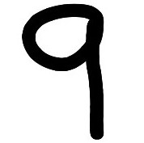

# Digit Classifier Using KNN

CONTENTS OF THIS FILE
---------------------

 * Introduction
 * Usage

INTRODUCTION
------------
A machine learner using K-Nearest Neighbors method (KNN) to predict a single handwritten digit. The learner uses the scikit-learn
digits dataset for training purpose. The project takes a jpg file as input and then this jpg is transformed into a 32x32 bmp image. An example of an input image can
be seen below as well as in the examples directory.




After that, the image is segmented into distinct blocks of 4x4 and the number of on (black) pixels are counted depending on a threshold. An array of 64
values is created to represent each distinct block. This creates our instance vector which is used by the learner to predict the single digit. At the end,
the digit prediction is shown to the user.

Usage
------------

```sh
$ python main.py <image_name.jpg>
```
